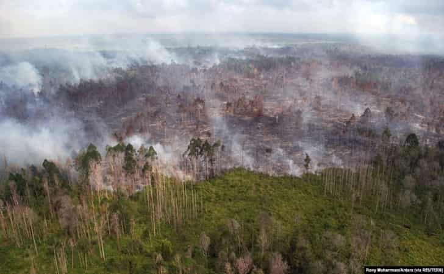
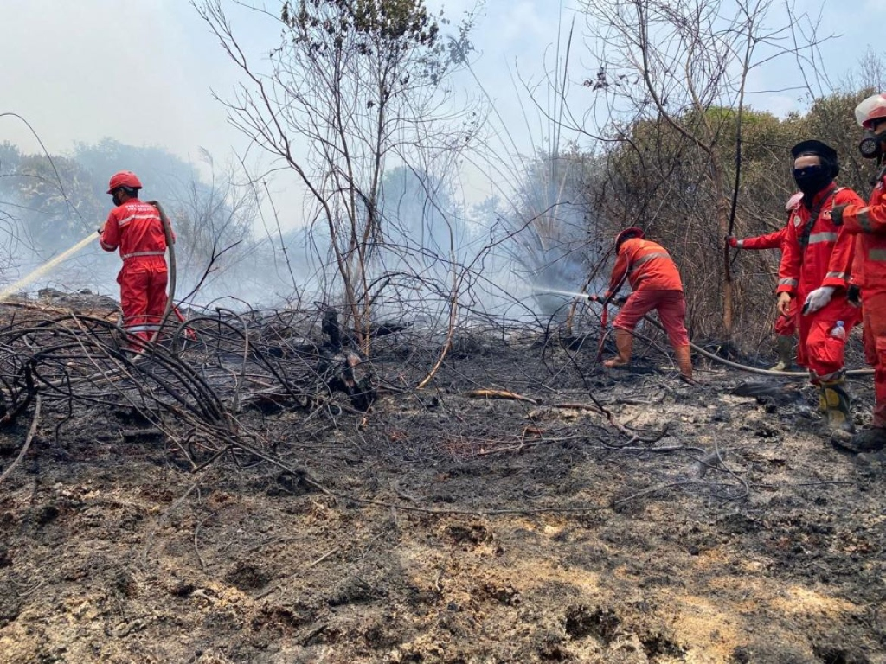
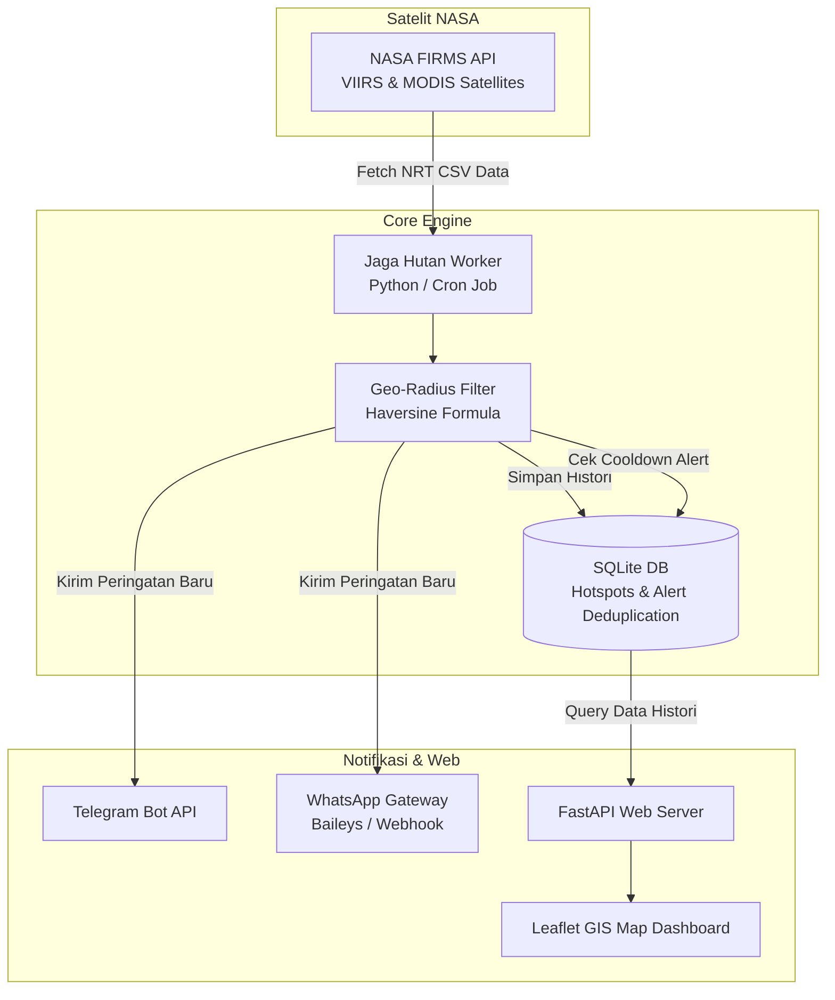

<div align="center">

# 🌲 Jaga Hutan (Forest Guard)
### *Open-Source AI & Satellite-Powered Wildfire Early Warning System*
**Sistem Monitoring & Peringatan Dini Karhutla Berbasis Satelit NASA & Bot WhatsApp/Telegram**

<br/>

[](https://www.python.org/)
[](https://fastapi.tiangolo.com/)
[](https://firms.modaps.eosdis.nasa.gov/)
[](https://core.telegram.org/bots)
[](https://github.com/WhiskeySockets/Baileys)
[](https://opensource.org/licenses/MIT)

<br/>

[-FAAE2B?style=for-the-badge&logo=cashapp&logoColor=black)](https://saweria.co/angganz)
[](https://buymeacoffee.com/angganz)
[](https://github.com/angganzcool/Jaga-Hutan)
[](https://github.com/angganzcool/Jaga-Hutan)

<br/>

<!-- Language Switcher Buttons -->
### 🌐 Pilih Bahasa / Select Language

[](#-bahasa-indonesia) &nbsp;&nbsp;&nbsp;&nbsp; [](#-english)

<br/>


<p align="center"><i>Pantauan kabut asap dan kebakaran hutan dan lahan gambut (Karhutla) di Indonesia</i></p>

---

</div>

<br/>

<div id="-bahasa-indonesia"></div>

## 🇮🇩 Bahasa Indonesia

<div align="right">
  <a href="#-english">👉 <b>[Switch to English 🇬🇧]</b></a>
</div>

### 💡 Mengapa Jaga Hutan?
Kebakaran Hutan dan Lahan (Karhutla) serta pengrusakan ekosistem gambut melepaskan jutaan ton emisi karbon dan memicu bencana kabut asap lintas negara. Sistem monitoring satelit komersial seringkali mahal dan sulit dijangkau masyarakat di garis depan.

<div align="center">
  
  <p><i>Tim patroli lapangan membutuhkan deteksi dini yang cepat dan akurat ke smartphone mereka.</i></p>
</div>

**Jaga Hutan** adalah proyek *open-source* berbiaya rendah (bahkan hampir **100% gratis**) yang memungkinkan relawan, petugas desa, aktivis lingkungan, hingga perusahaan untuk:
1. **Memantau titik panas (*hotspot*) satelit secara otomatis** 24/7.
2. **Menyaring area spesifik** (radius desa, batas konsesi, hutan lindung).
3. **Menerima alert dini seketika via WhatsApp & Telegram** lengkap dengan titik koordinat dan navigasi Google Maps.
4. **Melihat peta sebaran titik api interaktif** melalui Web GIS ringan.

---

### ✨ Fitur Unggulan

- 🛰️ **Integrasi NASA FIRMS Near-Real-Time (NRT)**: Mengakses data satelit resolusi tinggi **VIIRS** (Suomi NPP, NOAA-20, NOAA-21) dan **MODIS** (Terra & Aqua).
- 🎯 **Filter Geografis Presisi**: Menggunakan algoritma *Haversine* untuk menghitung jarak akurat titik api terhadap pusat wilayah pantauan.
- 🛡️ **Anti-Spam & Smart Deduplication**: Basis data SQLite otomatis mencatat titik api dan menerapkan *cooldown* 12 jam agar WhatsApp/Telegram tidak dibanjiri pesan berulang.
- 💬 **Multi-Channel Alert**:
  - **Telegram Bot**: Pesan darurat lengkap dengan Fire Radiative Power (FRP), kecerahan Kelvin, tingkat kepercayaan (*confidence*), dan tautan GPS.
  - **WhatsApp Gateway**: Siap terhubung ke Baileys / WPPConnect / Evolution API.
- 🗺️ **Dashboard Peta Interaktif (Leaflet.js + FastAPI)**: Tampilan visual titik pantau radius dan titik api bergradasi warna sesuai tingkat keparahan.
- ⚡ **Ringan & Hemat Resource**: Berjalan mulus di VPS termurah ($3-$5/bulan) atau bahkan Raspberry Pi.

---

### 🏛️ Arsitektur Sistem



---

### 🚀 Cara Mulai Cepat (3 Menit)

#### 1. Klon Repositori & Pasang Dependensi
```bash
git clone https://github.com/angganzcool/Jaga-Hutan.git
cd Jaga-Hutan
pip install -r requirements.txt
```

#### 2. Dapatkan Kunci API NASA FIRMS (Gratis)
- Buka: [https://firms.modaps.eosdis.nasa.gov/api/map_key/](https://firms.modaps.eosdis.nasa.gov/api/map_key/)
- Masukkan email Anda, `MAP_KEY` akan langsung dikirim ke inbox Anda.

#### 3. Konfigurasi Lingkungan
Salin file konfigurasi:
```bash
cp .env.example .env
```
Isi konfigurasi pada `.env`:
```ini
FIRMS_MAP_KEY=masukkan_map_key_nasa_anda
TELEGRAM_ENABLED=true
TELEGRAM_BOT_TOKEN=token_bot_telegram_anda
TELEGRAM_CHAT_ID=id_chat_atau_grup_anda

WHATSAPP_ENABLED=true
WHATSAPP_WEBHOOK_URL=http://localhost:3000/api/send-message
WHATSAPP_TARGET_NUMBER=628123456789@s.whatsapp.net
```

Tentukan wilayah pantauan di [`locations.json`](file:///d:/Jaga%20Hutan/locations.json):
```json
[
  {
    "id": "loc_palangkaraya",
    "name": "Area Hutan Palangka Raya",
    "latitude": -2.2161,
    "longitude": 113.9139,
    "radius_km": 30.0,
    "min_confidence": "nominal"
  }
]
```

#### 4. Jalankan Aplikasi
- **Uji Coba Cepat (Mode Simulasi)**:
  ```bash
  python main.py --simulate
  ```
- **Jalankan Monitoring 1x (Cocok untuk Cron Job VPS)**:
  ```bash
  python main.py --once
  ```
- **Buka Web Dashboard Peta**:
  ```bash
  python app.py
  ```
  Buka browser di `http://localhost:8000`.

---

<br/>

<div id="-english"></div>

## 🇬🇧 English

<div align="right">
  <a href="#-bahasa-indonesia">👉 <b>[Baca dalam Bahasa Indonesia 🇮🇩]</b></a>
</div>

### 💡 Why Jaga Hutan?
Wildfires and peatland degradation release millions of tons of greenhouse gases into the atmosphere and cause hazardous transboundary haze. Commercial satellite monitoring platforms are often expensive and out of reach for frontline rangers and local communities.

<div align="center">
  
  <p><i>Empowering local patrol units with real-time early warnings sent straight to WhatsApp & Telegram.</i></p>
</div>

**Jaga Hutan** (*"Guard the Forest"*) is a lightweight, open-source, ultra-low-cost (nearly **100% free**) wildfire and hotspot early warning ecosystem designed to empower rangers, indigenous communities, NGOs, and environmental organizations worldwide.

---

### ✨ Key Features

- 🛰️ **NASA FIRMS Near-Real-Time Integration**: Ingests high-resolution hotspot feeds from **VIIRS** (SNPP, NOAA-20, NOAA-21) and **MODIS** instruments.
- 🎯 **Targeted Geo-Radius Filtering**: Calculates Great-Circle distances using the *Haversine formula* against custom radii (villages, concession borders, national parks).
- 🛡️ **Zero-Spam Deduplication Engine**: SQLite-backed tracking prevents repetitive notifications during cooldown periods (default: 12 hours).
- 💬 **Instant Multi-Channel Dispatcher**:
  - **Telegram Bot**: Rich HTML alerts featuring Fire Radiative Power (FRP), Kelvin brightness temperature, confidence levels, and direct Google Maps/OSM navigation links.
  - **WhatsApp API Gateway**: Compatible with Baileys, Evolution API, and custom webhooks.
- 🗺️ **Interactive Web GIS Dashboard**: Fast, responsive Leaflet.js mapping interface built on FastAPI.
- ⚡ **Resource Efficient**: Runs effortlessly on a budget $3-$5/month VPS, Docker container, or Raspberry Pi.

---

### 🗺️ Project Roadmap

- [x] **Phase 1**: NASA FIRMS NRT Ingestion & Geo-Radius Engine
- [x] **Phase 2**: SQLite Deduplication, Telegram & WhatsApp Alert Bot
- [x] **Phase 3**: FastAPI + Leaflet Interactive Web GIS Dashboard
- [ ] **Phase 4**: Edge AI Smoke & Fire Detection using YOLOv8 on CCTV / Tower Cameras
- [ ] **Phase 5**: Peatland Moisture & BMKG Weather Early Fire Risk Prediction Index

---

<br/>

<div id="-dukungan--donasi--support--donate"></div>

## ☕ Dukungan & Donasi / Support & Donate

Proyek **Jaga Hutan** dikembangkan secara independen dan bersifat *open-source* untuk membantu pelestarian lingkungan serta pencegahan karhutla. 

Dukungan dari Anda sangat berarti untuk membiayai server riset, infrastruktur peta publik, dan edukasi pencegahan karhutla ke masyarakat lapangan.

<div align="center">

### 💚 Pilihan Jalur Donasi:

| 🇮🇩 Donasi Indonesia (QRIS / E-Wallet) | 🌍 International Donations |
| :---: | :---: |
| [](https://saweria.co/angganz) | [](https://buymeacoffee.com/angganz) |
| 👉 **[saweria.co/angganz](https://saweria.co/angganz)**<br>*(GoPay, OVO, DANA, ShopeePay, QRIS)* | 👉 **[buymeacoffee.com/angganz](https://buymeacoffee.com/angganz)**<br>*(Credit Card, Global Payments)* |

<br/>

*Terima kasih atas kepedulian Anda terhadap kelestarian hutan dan masa depan bumi kita!* 🌿

</div>

---

## 🤝 Kontribusi / Contributing

Kontribusi selalu terbuka dan disambut hangat! 
1. Fork repositori ini.
2. Buat branch fitur baru (`git checkout -b feature/FiturKeren`).
3. Commit perubahan Anda (`git commit -m 'Menambahkan fitur deteksi baru'`).
4. Push ke branch (`git push origin feature/FiturKeren`).
5. Buat Pull Request.

---

## 📄 Lisensi / License

Didistribusikan di bawah lisensi **MIT**. Lihat [`LICENSE`](file:///d:/Jaga%20Hutan/LICENSE) untuk informasi lebih lanjut.

<div align="center">
  <sub>Dibuat dengan ❤️ untuk hutan dan bumi yang lebih hijau.</sub>
</div>
