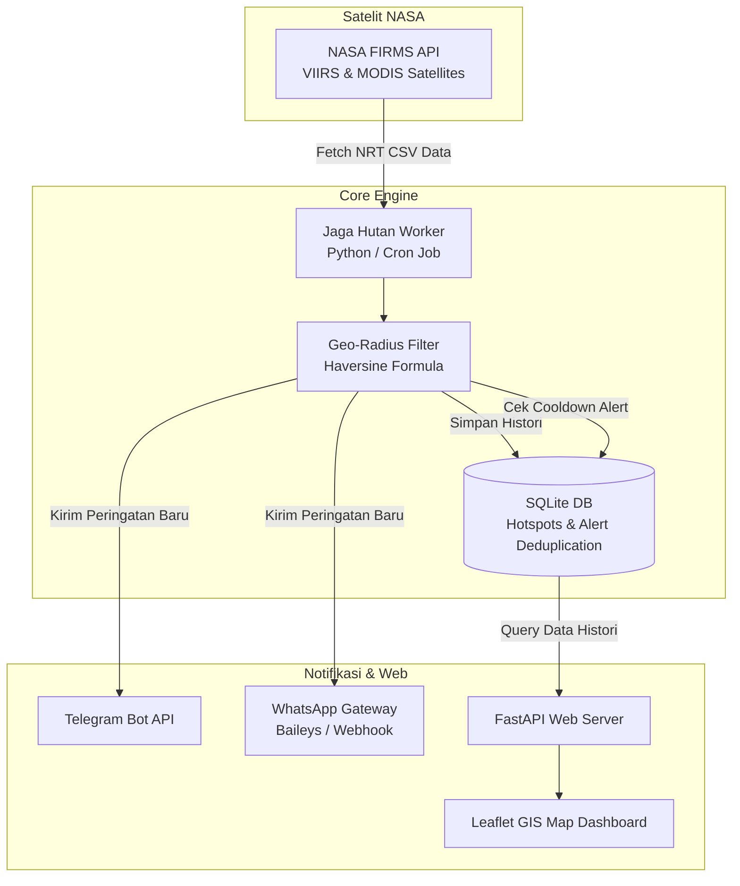

<div align="center">

# 🌲 Jaga Hutan (Forest Guard)
### *Open-Source AI & Satellite-Powered Early Warning System for Wildfire & Hotspot Detection*
**Sistem Monitoring & Peringatan Dini Karhutla Berbasis Satelit NASA & Bot WhatsApp/Telegram**

<br/>

[](https://www.python.org/)
[](https://fastapi.tiangolo.com/)
[](https://firms.modaps.eosdis.nasa.gov/)
[](https://core.telegram.org/bots)
[](https://github.com/WhiskeySockets/Baileys)
[](https://opensource.org/licenses/MIT)

<br/>

[](https://www.paypal.com/webapps/billing/plans/subscribe?plan_id=P-63C1163027265553ANKGZKEI)
[](https://github.com)
[](https://github.com)

<br/>

**[🇮🇩 Baca dalam Bahasa Indonesia](#-bahasa-indonesia)** • **[🇬🇧 Read in English](#-english)** • **[☕ Dukung & Donasi](#-dukungan--donasi--support--donate)**

---

</div>

<br/>

<div id="-bahasa-indonesia"></div>

## 🇮🇩 Bahasa Indonesia

### 💡 Mengapa Jaga Hutan?
Kebakaran Hutan dan Lahan (Karhutla) serta pengrusakan ekosistem gambut melepaskan jutaan ton karbon dan memicu kabut asap lintas negara. Sistem monitoring korporat seringkali mahal dan sulit diakses masyarakat lokal.

**Jaga Hutan** adalah proyek *open-source* berbiaya rendah (bahkan hampir **100% gratis**) yang memungkinkan siapa saja—mulai dari relawan, aktivis lingkungan, perangkat desa, hingga perusahaan—untuk:
1. **Memantau titik panas (*hotspot*) satelit secara otomatis** 24/7.
2. **Menyaring area spesifik** (radius desa, batas konsesi, hutan lindung).
3. **Menerima alert dini seketika via WhatsApp & Telegram** lengkap dengan titik koordinat dan navigasi Google Maps.
4. **Melihat peta sebaran titik api interaktif** melalui Web GIS ringan.

---

### ✨ Fitur Unggulan

- 🛰️ **Integrasi NASA FIRMS Near-Real-Time (NRT)**: Mengakses data satelit resolusi tinggi **VIIRS** (Suomi NPP, NOAA-20, NOAA-21) dan **MODIS** (Terra & Aqua).
- 🎯 **Filter Geografis Presisi**: Menggunakan algoritma *Haversine* untuk menghitung jarak akurat titik api terhadap pusat wilayah pantauan.
- 🛡️ **Anti-Spam & Smart Deduplication**: Basis data SQLite otomatis mencatat titik api dan menerapkan *cooldown* 12 jam agar WhatsApp/Telegram tidak dibanjiri pesan berulang.
- 💬 **Multi-Channel Alert**:
  - **Telegram Bot**: Pesan darurat lengkap dengan Fire Radiative Power (FRP), kecerahan Kelvin, tingkat kepercayaan (*confidence*), dan tautan GPS.
  - **WhatsApp Gateway**: Siap terhubung ke Baileys / WPPConnect / Evolution API.
- 🗺️ **Dashboard Peta Interaktif (Leaflet.js + FastAPI)**: Tampilan visual titik pantau radius dan titik api bergradasi warna sesuai tingkat keparahan.
- ⚡ **Ringan & Hemat Resource**: Berjalan mulus di VPS termurah ($3-$5/bulan) atau bahkan Raspberry Pi.

---

### 🏛️ Arsitektur Sistem



---

### 🚀 Cara Mulai Cepat (3 Menit)

#### 1. Klon Repositori & Pasang Dependensi
```bash
git clone https://github.com/yourusername/Jaga-Hutan.git
cd Jaga-Hutan
pip install -r requirements.txt
```

#### 2. Dapatkan Kunci API NASA FIRMS (Gratis)
- Buka: [https://firms.modaps.eosdis.nasa.gov/api/map_key/](https://firms.modaps.eosdis.nasa.gov/api/map_key/)
- Masukkan email Anda, `MAP_KEY` akan langsung dikirim ke inbox Anda.

#### 3. Konfigurasi Lingkungan
Salin file konfigurasi:
```bash
cp .env.example .env
```
Isi konfigurasi pada `.env`:
```ini
FIRMS_MAP_KEY=masukkan_map_key_nasa_anda
TELEGRAM_ENABLED=true
TELEGRAM_BOT_TOKEN=token_bot_telegram_anda
TELEGRAM_CHAT_ID=id_chat_atau_grup_anda

WHATSAPP_ENABLED=true
WHATSAPP_WEBHOOK_URL=http://localhost:3000/api/send-message
WHATSAPP_TARGET_NUMBER=628123456789@s.whatsapp.net
```

Tentukan wilayah pantauan di [`locations.json`](file:///d:/Jaga%20Hutan/locations.json):
```json
[
  {
    "id": "loc_palangkaraya",
    "name": "Area Hutan Palangka Raya",
    "latitude": -2.2161,
    "longitude": 113.9139,
    "radius_km": 30.0,
    "min_confidence": "nominal"
  }
]
```

#### 4. Jalankan Aplikasi
- **Uji Coba Cepat (Mode Simulasi)**:
  ```bash
  python main.py --simulate
  ```
- **Jalankan Monitoring 1x (Cocok untuk Cron Job VPS)**:
  ```bash
  python main.py --once
  ```
- **Buka Web Dashboard Peta**:
  ```bash
  python app.py
  ```
  Buka browser di `http://localhost:8000`.

---

<br/>

<div id="-english"></div>

## 🇬🇧 English

### 💡 Why Jaga Hutan?
Wildfires and peatland degradation release millions of tons of greenhouse gases into the atmosphere and cause hazardous transboundary haze. Commercial satellite monitoring platforms are often expensive and out of reach for local communities and frontline rangers.

**Jaga Hutan** (*"Guard the Forest"*) is a lightweight, open-source, ultra-low-cost (nearly **100% free**) wildfire and hotspot early warning ecosystem designed to empower rangers, indigenous communities, NGOs, and environmental organizations worldwide.

---

### ✨ Key Features

- 🛰️ **NASA FIRMS Near-Real-Time Integration**: Ingests high-resolution hotspot feeds from **VIIRS** (SNPP, NOAA-20, NOAA-21) and **MODIS** instruments.
- 🎯 **Targeted Geo-Radius Filtering**: Calculates Great-Circle distances using the *Haversine formula* against custom radii (villages, concession borders, national parks).
- 🛡️ **Zero-Spam Deduplication Engine**: SQLite-backed tracking prevents repetitive notifications during cooldown periods (default: 12 hours).
- 💬 **Instant Multi-Channel Dispatcher**:
  - **Telegram Bot**: Rich HTML alerts featuring Fire Radiative Power (FRP), Kelvin brightness temperature, confidence levels, and direct Google Maps/OSM navigation links.
  - **WhatsApp API Gateway**: Compatible with Baileys, Evolution API, and custom webhooks.
- 🗺️ **Interactive Web GIS Dashboard**: Fast, responsive Leaflet.js mapping interface built on FastAPI.
- ⚡ **Resource Efficient**: Runs effortlessly on a budget $3-$5/month VPS, Docker container, or Raspberry Pi.

---

### 🗺️ Project Roadmap

- [x] **Phase 1**: NASA FIRMS NRT Ingestion & Geo-Radius Engine
- [x] **Phase 2**: SQLite Deduplication, Telegram & WhatsApp Alert Bot
- [x] **Phase 3**: FastAPI + Leaflet Interactive Web GIS Dashboard
- [ ] **Phase 4**: Edge AI Smoke & Fire Detection using YOLOv8 on CCTV / Tower Cameras
- [ ] **Phase 5**: Peatland Moisture & BMKG Weather Early Fire Risk Prediction Index

---

<br/>

<div id="-dukungan--donasi--support--donate"></div>

## ☕ Dukungan & Donasi / Support & Donate

Proyek **Jaga Hutan** dikembangkan secara independen dan bersifat *open-source* untuk membantu pelestarian lingkungan serta pencegahan karhutla. 

Dukungan finansial dari Anda sangat berarti untuk:
- 🛰️ Pengembangan fitur AI & integrasi data satelit lanjutan.
- 🖥️ Penyediaan server pengujian & infrastruktur open-data publik.
- 🌲 Pelatihan dan pendampingan implementasi bagi komunitas/relawan di lapangan.

<div align="center">

### 💚 Langganan Donasi / Monthly Sponsorship via PayPal:

[](https://www.paypal.com/webapps/billing/plans/subscribe?plan_id=P-63C1163027265553ANKGZKEI)

👉 **[Klik di Sini untuk Berlangganan Donasi via PayPal](https://www.paypal.com/webapps/billing/plans/subscribe?plan_id=P-63C1163027265553ANKGZKEI)** 👈

*Terima kasih atas kepedulian Anda terhadap kelestarian hutan dan masa depan bumi kita!* 🌿

</div>

---

## 🤝 Kontribusi / Contributing

Kontribusi selalu terbuka dan disambut hangat! 
1. Fork repositori ini.
2. Buat branch fitur baru (`git checkout -b feature/FiturKeren`).
3. Commit perubahan Anda (`git commit -m 'Menambahkan fitur deteksi baru'`).
4. Push ke branch (`git push origin feature/FiturKeren`).
5. Buat Pull Request.

---

## 📄 Lisensi / License

Didistribusikan di bawah lisensi **MIT**. Lihat [`LICENSE`](file:///d:/Jaga%20Hutan/LICENSE) untuk informasi lebih lanjut.

<div align="center">
  <sub>Dibuat dengan ❤️ untuk hutan dan bumi yang lebih hijau.</sub>
</div>
